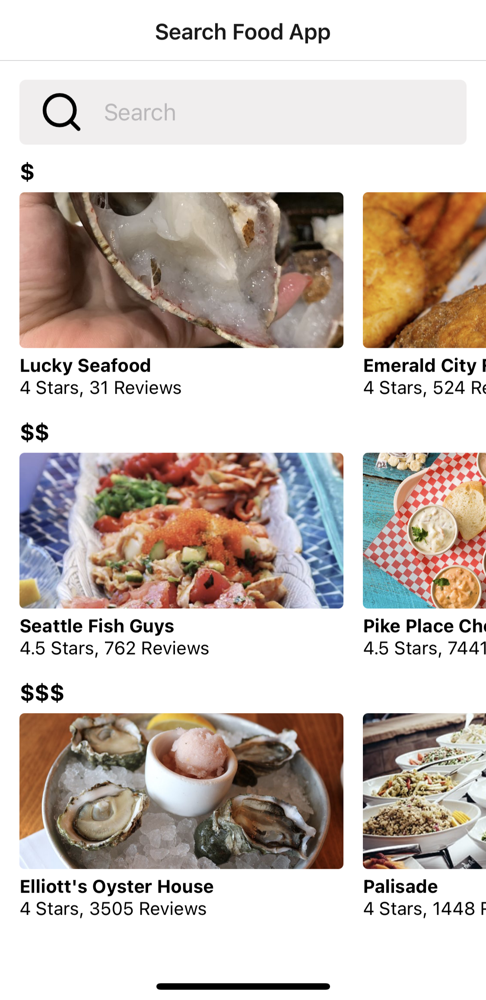
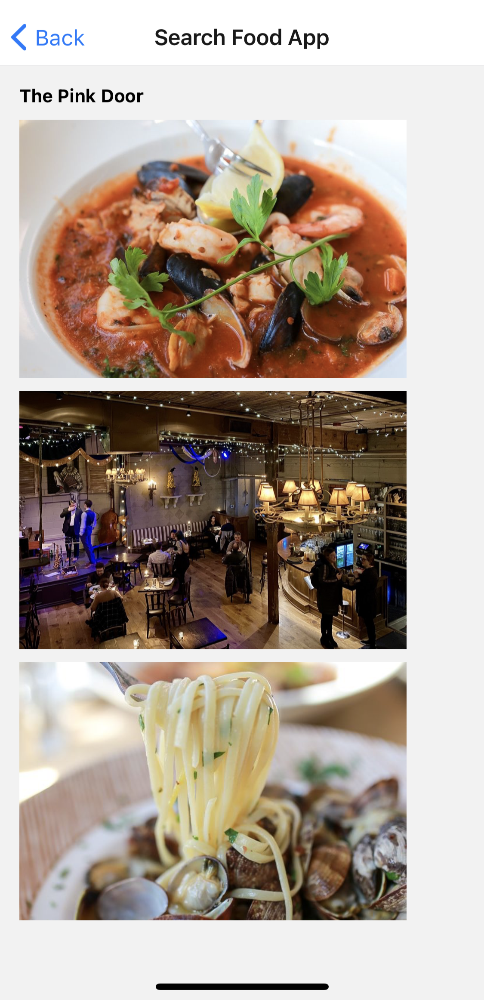

# Seattle food application

#### React Native, 01/21/2021

#### By _**Evgeniya Chernaya**_

## Description

React Native application for searching the food places in Seattle (using Yelp API).

 

## Setup/Installation Requirements

* Clone the repository to your desired directory (git clone https://github.com/janecher/seattle-food.git).
* Install Node.js (https://nodejs.org/en/download/) on your computer, and Expo app on your phone.
* Do "npm install", then "npm start" in the terminal.
* Run the app on your phone by QR code in the terminal.

 

## Known Bugs

_No known bags_

## Support and contact details

Contact me at _evgenya.chernaya@gmail.com_

## Technologies Used

* React Native
* JavaScript
* JSX

### License

_This software is licensed under the MIT license_

Copyright (c) 2021 **Evgeniya Chernaya**